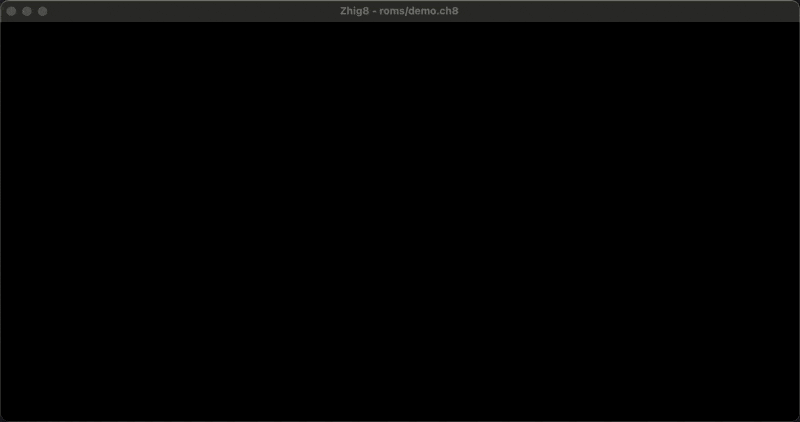

# Zhig8 - CHIP-8 Emulator in Zig

A simple [CHIP-8](https://en.wikipedia.org/wiki/CHIP-8) emulator written in [Zig](https://ziglang.org/) that uses [SDL2](https://www.libsdl.org/) for graphics and input.

<div align="center">
  
</div>

## Features

- Loads and executes a CHIP-8 ROM.
- Emulates the original CHIP-8 instructions and quirks.
- Uses SDL2 to open a window for rendering the graphics buffer.
- Adjustable configuration options (e.g. screen scale, CPU frequency) in `config.zig`.

## Project Structure

```
.
├── README.md         # This file
├── main.zig          # The entry point of the application
├── config.zig        # Global configuration constants
└── chip8.zig         # The core Chip8 emulator implementation
```

- **`main.zig`**:
  - Sets up the SDL window and renderer.
  - Reads command-line arguments to load a ROM.
  - Instantiates the CHIP-8 emulator (`chip8.Chip8`) and handles the main event loop.
- **`config.zig`**:
  - Holds configurable constants like `MULT`, `CPU_FREQ`, and `GRID`.
- **`chip8.zig`**:
  - Defines the `Chip8` struct and its methods (loading the font and ROM, executing instructions, updating timers, drawing to SDL).
  - Maintains all the emulator state (RAM, registers, stack, keyboard, timers).
  - Implements the opcode switch logic.

## Requirements

1. **Zig** (version 0.13.0 was used to develop the project).

## Building

1. **Clone or download** this repository.
2. **Build** with Zig:
   ```sh
   zig build --release=fast -p . --prefix-exe-dir .
   ```

3. After successful compilation, an executable (e.g. `zhig8`) is produced in the current directory.

## Usage

```
./zhig8 <path_to_rom>
```

For example:
```sh
./zhig8 roms/demo.ch8
```

- The emulator reads the specified ROM file into memory and attempts to run it.
- Use the key mappings specified in `chip8.zig` under the `key_map` initializations (e.g., `1, 2, 3, 4, Q, W, E, R, ...`) to interact with programs.

## Configuration

You can tweak various settings in `config.zig`:

- `pub const MULT = 16;`  
  The pixel size multiplier for the 64×32 display. Increasing or decreasing this will scale up or down the display.
- `pub const CPU_FREQ = 1000.0;`  
  The approximate frequency (in Hz) at which the CHIP-8 instructions are executed.
- `pub const GRID = false;`  
  If `true`, a grid overlay is drawn (helpful for debugging).

## Contributing

Feel free to open issues or pull requests to improve compatibility, add features (like sound or extended opcodes), or improve performance.

## License

See [LICENSE](LICENSE) for details, or simply note that you may freely use, modify, and distribute this code.